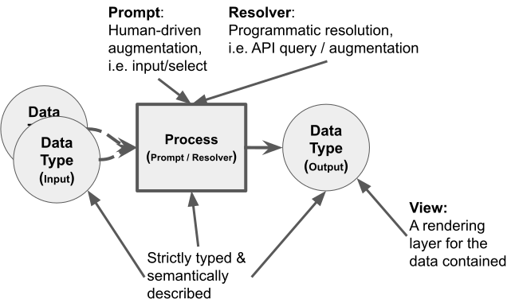
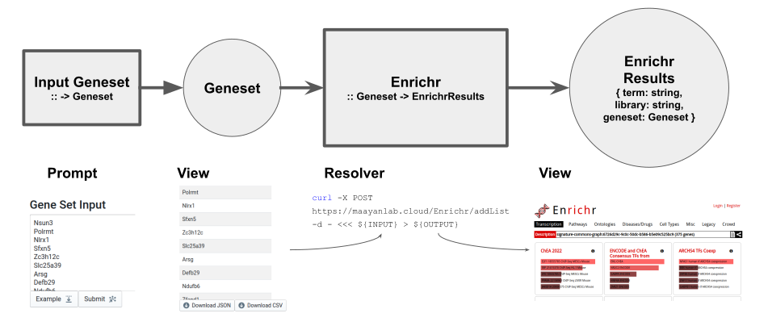
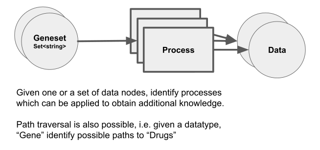
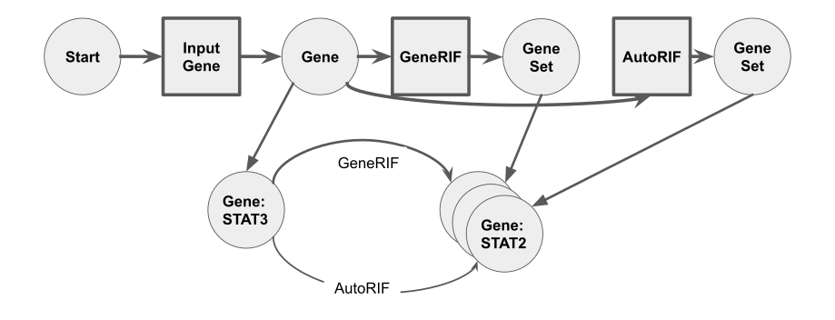

# Playbook Background
In an effort to enable parallel development of the playbook, we've organized the playbook to permit several kinds of semantically annotated contributions which can be integrated into a larger application which can be developed in parallel.

## Meta Nodes

The term "meta node" is used to represent the knowledge resolution graph node specifications. That-is the data structure used to describe a semantic type and perscribed typescript type of output. The two main types of meta nodes are `Data` and `Process`es. Processes can have multiple data types as inputs but must have one and only one as output. Processes have two subtypes, `Prompt` which is a human-driven process (such as an input form or interactive selection interface) or a `Resolver`, which is purely programatic (such as an API call or data augmentation step).

### Meta Node Implementations

Meta nodes are implemented by defining the semantic description, typescript-constrained type and functionality of that node. Above we see an example of some implemented meta nodes and how they relate to one another.

1. The first metanode is a prompt process which obtains a Geneset from the user
2. The second metanode is a data type of Geneset with a view for reviewing and downloading the geneset
3. The third metanode is a resolver process which submits the geneset to enrichr to perform enrichment analyis.
4. The forth metanode is a high level object representing the enrichr results with a view of them in enrichr for manual review. Additional resolvers could also be devised to finetune these results for downstream analysis.

### Meta Node DB

All implemented meta nodes can be registered into an in-memory database for lookup and neighbor querying among other possible operations. The playbook application uses this database to construct its interface in a data-driven fashion. As such, the application itself is a product of the contents of this database, and extending the functionality of the application is a matter of adding additional meta nodes.

## Justifications
Here we provide some justifications for the above approach.

### Modular Components
- By modularizing processes we can mix, match, and stack them to construct parametrizable playbooks.
- Components and playbooks have consistent interfaces and can thus be exposed in consistent ways such as over API or through novel visual interfaces.

### Meta Node Path to Knowledge Graph

Through building a "resolution knowledge graph" we can construct classic knowledge graphs based on any given path or playbook through the resolution knowledge graph once concrete information is resolved. These graphs are federated and can be re-computed to receive more up to date information or augmented.
