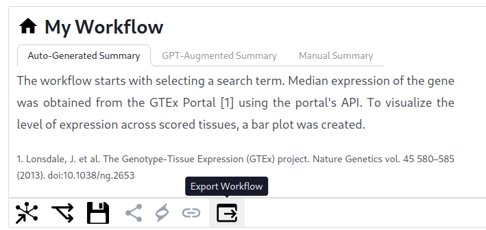

# API User Guide

The Playbook Partnership API allows you to construct workflows via a REST API. Workflows are specified using a JSON serialized domain specific language (DSL), they are then registered into the database and either the output can be resolved or the resulting playbook can be visited.

Browsable API docs will be available in the future, for now, these documents can be constructed with the help of the UI's export feature.

## Building a Workflow

A workflow can first be constructed via the playbook workflow builder user interface, see the [Building Workflows with the Playbook](./workflows.md) guide for more details. Once constructed, from the report mode the workflow can be "exported" as a JSON document.


**Figure 1.** The button on the user interface for exporting a playbook workflow as JSON.

This document looks something like so:
```json
{
  "data":{
    "12c02bd3-f2ec-c719-533f-b1bb3b0170b7":{"type":"Input[Gene]","value":"ACE2"}
  },
  "workflow":[
    {"id":"83efe773-027b-4f21-688d-b27555938a04","type":"Input[Gene]","data":{"id":"12c02bd3-f2ec-c719-533f-b1bb3b0170b7"}},
    {"id":"43854076-44ba-9ccb-22ce-d0f111c32752","type":"GTExTissueExpressionFromGene","inputs":{"gene":{"id":"83efe773-027b-4f21-688d-b27555938a04"}}},
    {"id":"33cdac4f-49de-6c59-5566-917e1bd390a3","type":"BarplotFrom[Scored[Tissue]]","inputs":{"terms":{"id":"43854076-44ba-9ccb-22ce-d0f111c32752"}}}
  ],
  "metadata":{
    "title":"GTEx Tissue Expression Barplot"
  }
}
```

## Parameterizing the Workflow in API calls
This same format is used to submit to the API, but naturally we'll want to change the inputs:

```python
import requests

# The playbook workflow builder endpoint to query
ENDPOINT = 'https://playbook-workflow-builder.cloud'

# Construct a workflow Gene => GTEx Tissue => Barplot with the input: ACE2
gene = 'ACE2'
res = requests.post(ENDPOINT + '/api/db/fpl', json={
  "data":{
    "12c02bd3-f2ec-c719-533f-b1bb3b0170b7":{"type":"Input[Gene]","value":gene}
  },
  "workflow":[
    {"id":"83efe773-027b-4f21-688d-b27555938a04","type":"Input[Gene]","data":{"id":"12c02bd3-f2ec-c719-533f-b1bb3b0170b7"}},
    {"id":"43854076-44ba-9ccb-22ce-d0f111c32752","type":"GTExTissueExpressionFromGene","inputs":{"gene":{"id":"83efe773-027b-4f21-688d-b27555938a04"}}},
    {"id":"33cdac4f-49de-6c59-5566-917e1bd390a3","type":"BarplotFrom[Scored[Tissue]]","inputs":{"terms":{"id":"43854076-44ba-9ccb-22ce-d0f111c32752"}}}
  ],
  "metadata":{
    "title":"GTEx Tissue Expression Barplot"
  }
})
playbook_id = res.json()
print(ENDPOINT + '/report/' + playbook_id)

# Obtain machine readable output of all nodes
output = requests.get(ENDPOINT + f"/api/db/fpl/{playbook_id}/output/export").json()
print(output)
```

## Explaining `/output`
Output follows the same form as the input, but each node will additionally have an `output` field with raw JSON corresponding to the typed information. For example:
```json
{
  "data":{
    "12c02bd3-f2ec-c719-533f-b1bb3b0170b7":{"type":"Input[Gene]","value":"ACE2"},
    "17165506-14be-2602-ba46-bc5f96d1ae6d":{"type":"Term[Gene]","value":"ACE2"},
    "6f2d30c6-f660-af7c-6f73-8d29bf2caa2b":{"type":"Scored[Tissue]","value": {}},
    "d4a4b8ab-049b-3ea6-96d3-d1f240fd1a11":{"type":"PlotlyPlot","value": {}}
  },
  "workflow":[
    {"id": "83efe773-027b-4f21-688d-b27555938a04", "type": "Input[Gene]", "data": {"id": "12c02bd3-f2ec-c719-533f-b1bb3b0170b7"}, "output": {"id": "17165506-14be-2602-ba46-bc5f96d1ae6d"}},
    {"id": "43854076-44ba-9ccb-22ce-d0f111c32752", "type": "GTExTissueExpressionFromGene", "inputs": {"gene": {"id": "83efe773-027b-4f21-688d-b27555938a04"}}, "output": {"id": "6f2d30c6-f660-af7c-6f73-8d29bf2caa2b"}},
    {"id": "33cdac4f-49de-6c59-5566-917e1bd390a3", "type": "BarplotFrom[Scored[Tissue]]", "inputs": {"terms": {"id": "43854076-44ba-9ccb-22ce-d0f111c32752"}}, "output": {"id": "d4a4b8ab-049b-3ea6-96d3-d1f240fd1a11"}}
  ],
  "metadata":{
    "title":"GTEx Tissue Expression Barplot"
  }
}
```

Note that the structure of each data `value` depends on the `type`, this type information will eventually be provided in an OpenAPI-like docs interface.


## Workflows with Files
In the case of a file, the "FileURL" takes an arbitrary http url or [DRS URI](https://ga4gh.github.io/data-repository-service-schemas/preview/release/drs-1.2.0/docs/).

```python
import requests

# The playbook workflow builder endpoint to query
ENDPOINT = 'https://playbook-workflow-builder.cloud'

# Construct a workflow FileInput => AnnDataFromFile => Limma-Voom with the example.h5ad file
res = requests.post(ENDPOINT + '/api/db/fpl', json={
  "workflow": [
    {"id": "0", "type": "FileInput", "data": { "type": "FileURL", "value": { "url": ENDPOINT + '/api/v1/components/core/file/example.h5ad', "filename": "example.h5ad" } } },
    {"id": "1", "type": "AnnDataFromFile", "inputs": { "file": { "id": "0" } } },
    {"id": "2", "type": "Limma-Voom", "inputs": { "anndata": { "id": "1" } } }
  ]
})
print(ENDPOINT + '/graph/' + res.json())
```

Note, from this example that workflows can be constructed somewhat manually if familiar with the available components. `data` can be inlined, and `id`s can be arbitrary strings.

An API to enable you to upload your own file is coming soon.

## Using the ID

Both of these examples will return an `id` for the workflow. This id can be used as follows:
- `https://playbook-workflow-builder.cloud/graph/{id}` => The graph mode UI of the workflow
- `https://playbook-workflow-builder.cloud/report/{id}` => The report mode UI of the workflow
- `https://playbook-workflow-builder.cloud/api/db/fpl/{id}` => See the resulting workflow as registered in the db
- `https://playbook-workflow-builder.cloud/api/db/fpl/{id}/export` => Slightly reformatted version of above
- `https://playbook-workflow-builder.cloud/api/db/fpl/{id}/output` => See the resulting workflow along with its output (for all nodes)
- `https://playbook-workflow-builder.cloud/api/db/fpl/{id}/output/export` => Slightly reformatted version of above

Each process (step of the workflow) can be accessed independently, those ids are at `[{"id": "fpl_id", "process": { "id": "{process_id}", ... }, ... }]` and can be accessed like:
- `https://playbook-workflow-builder.cloud/api/db/process/{id}` => See the resulting process as registered in the db
- `https://playbook-workflow-builder.cloud/api/db/process/{id}/output` => See the resulting process along with its output (for all nodes)

## Learn More

[Find other topics in the Playbook Workflow Builder user guide](./index.md).
