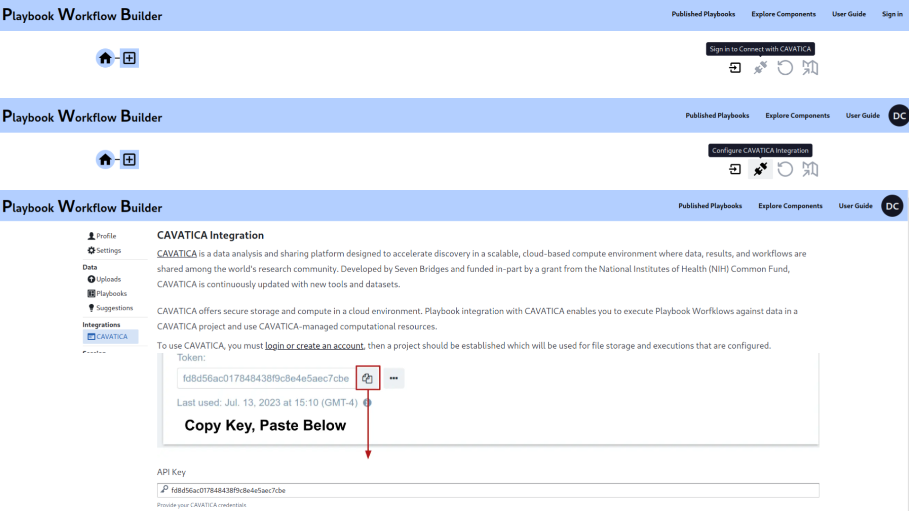
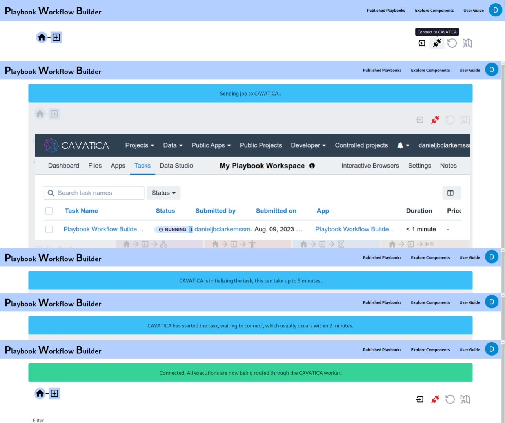
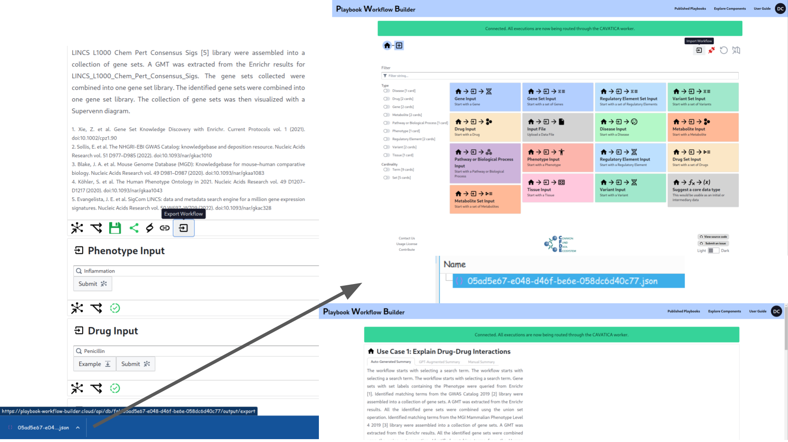
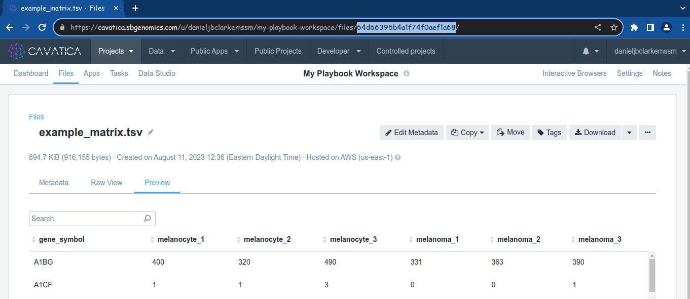
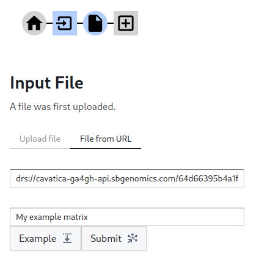

# Playbook with CAVATICA User Guide

[CAVATICA](https://www.cavatica.org/) is a data analysis and sharing platform designed to accelerate discovery in a scalable, cloud-based compute environment where data, results, and workflows are shared among the world's research community. Developed by Seven Bridges and funded in-part by a grant from the National Institutes of Health (NIH) Common Fund, CAVATICA is continuously updated with new tools and datasets.

CAVATICA offers secure storage and compute in a cloud environment, though integration with CAVATICA is still preliminary, your CAVATICA account can be used for operating the playbook using your own private computation and storage. Once configured and activated, you'll be able to use the playbook the same way as you do with the public compute resources, but all information will be processed and persisted by a worker launched in your CAVATICA account, and all persisted data files will remain in your CAVATICA workspace.

## Connecting with CAVATICA

To begin, you will need to log in and configure CAVATICA integrations in your account settings (Fig. 1). Instructions can be found on the CAVATICA integrations page about how to register with CAVATICA if you don't yet have an account and what information is necessary to provide to the playbook. 

  
**Figure 1.** A screenshot showing the steps to configure CAVATICA.

With CAVATICA configured, it is possible to connect to CAVATICA when you would like to perform computations using your CAVATICA resources. To do so, you click the connect button which triggers the worker in your account (Fig. 2). It can take some time to start up, the task will also be visible in the CAVATICA project you registered.

  
**Figure 2.** A screenshot showing CAVATICA integration initialization stages.

**As long as the worker is running, you will be accruing costs on your CAVATICA account, even if you aren't actively doing anything.** In my testing and at the time of writing, CAVATICA charges about `$0.007/minute`. At any time, you can click the red disconnect button to close the session, which will immediately end the task on your account and bring you back to the standard site.

If you leave without disconnecting, you can use the back button on your browser to disconnect. Otherwise, the task will automatically shut itself down after 2 minutes of inactivity.

## Using Published Playbooks in CAVATICA

Since the CAVATICA worker is blank, it won't have the published playbooks or indeed any of the playbooks you've saved to your account. To transfer them, you can use the playbook export & import feature (Fig. 3).

  
**Figure 3.** A screenshot showing how to use the export & import features.

## Accessing Files in your CAVATICA Workspace

CAVATICA's files are accessible over DRS from the CAVATICA environment, but only with your authentication token. The file ID which is visible on the URL of a file in CAVATICA, is the same id which you can use to access it with DRS from: `drs://cavatica-ga4gh-api.sbgenomics.com/{file_id}#?headers={"X-SBG-Auth-Token":"{cavatica_api_key}"}`.

  
**Figure 4.** A screenshot showing the CAVATICA File ID.

In this case the DRS URI would be:
`drs://cavatica-ga4gh-api.sbgenomics.com/64d66395b4a1f74f0aef1a68#?headers={"X-SBG-Auth-Token":"_your_cavatica_key_"}`

This DRS URI can then be used when inputting a file (Fig. 5)

  
**Figure 5.** A screenshot of the DRS input.

Alternatively, the standard upload feature will upload files directly into your CAVATICA account.

## Learn More

[Find other topics in the Playbook Workflow Builder user guide](./index.md).
