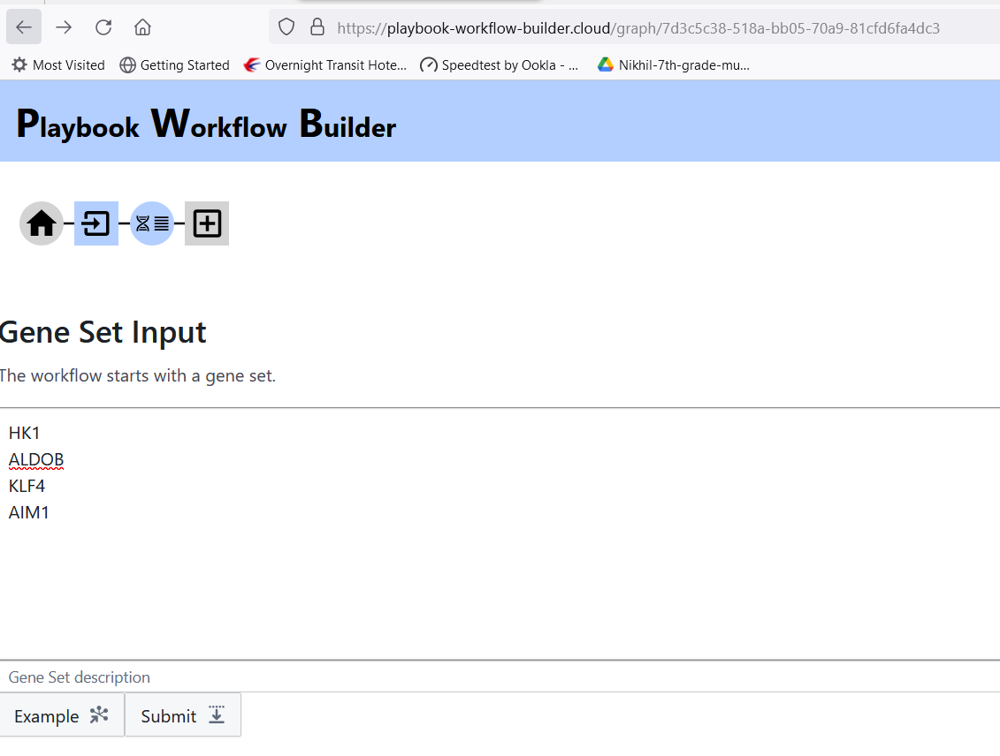
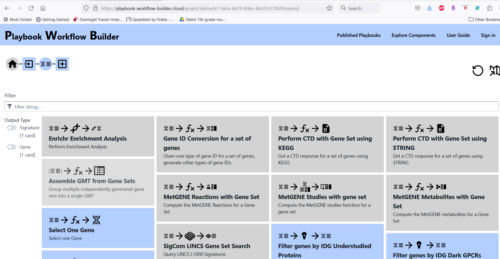
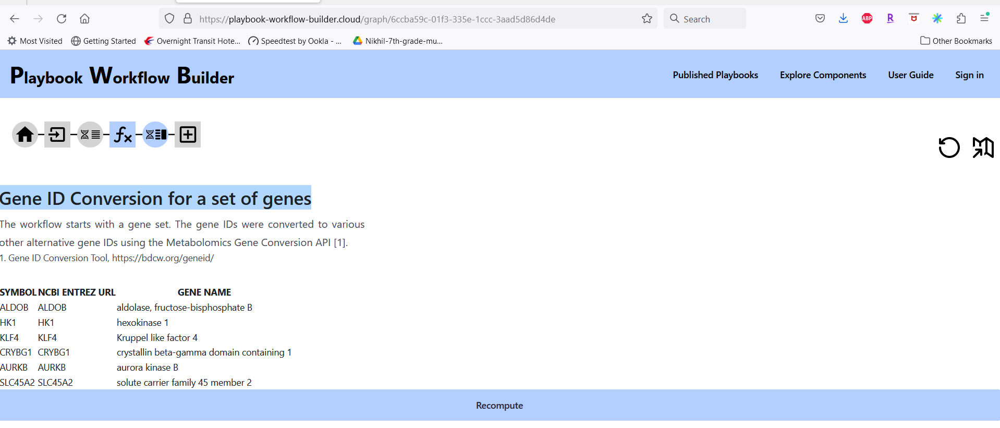

# Gene ID Conversion Tool

Conversion of one type of gene ID (such as SYMBOL or ENTREZ gene ID) into other types of IDs (such as ENSEMBL or UNIPROT)
Genomic and gene expression data is integral to biomolecular data analysis. The types of identifiers used for genes differ across different resources providing such data sets. The ability to use a single type of gene identifier is imperative for integrating data from two or more resources. This gene ID conversion tool facilitates the use of a common gene identifier. A [tutorial](https://bdcw.org/MW/docs/geneid_conversion_20220822.pdf) provides an overview and the steps of how to use this tool.

This tool is available through the web at [Gene ID Conversion](https://bdcw.org/geneid/) and also as a REST API ([SmartAPI for Gene ID Conversion](https://smart-api.info/ui/e712b9eb07e637a00ae468f757ce2a1f)). The SmartAPI page provides an explanation of the various parameters.

The Gene ID Conversion Tool has been integrated into the Playbook Workflow Builder Tool [<https://playbook-workflow-builder.cloud/graph>]. Below, we provide an example of how the conversion tool can be used in a workflow. Starting with a gene or a set of genes (Gene Set) [Figure 1], the first level of query brings up the Gene ID conversion tool as one of the processes as shown in Figure 2.

Figure 1. Input a list of genes (Gene Set)

We apply the process "Gene ID Conversion for a set of genes".

Figure 2. Gene ID Conversion process is the second from the left in the first row.

The results of the ID conversion are summarized in Figure 3. One of the genes, AIM1, is an alias for three different genes, hence all the three genes (CRYBG1, ARRKB, and SLC45A2) are listed. Based on this, a user may want to carry out additional research to decide which gene was actually meant by AIM1.

Figure 3. Summary of results of gene ID conversion. Other IDs are available in the resulting object.

## Learn More

[Find other topics in the Playbook Workflow Builder user guide](./index.md).
