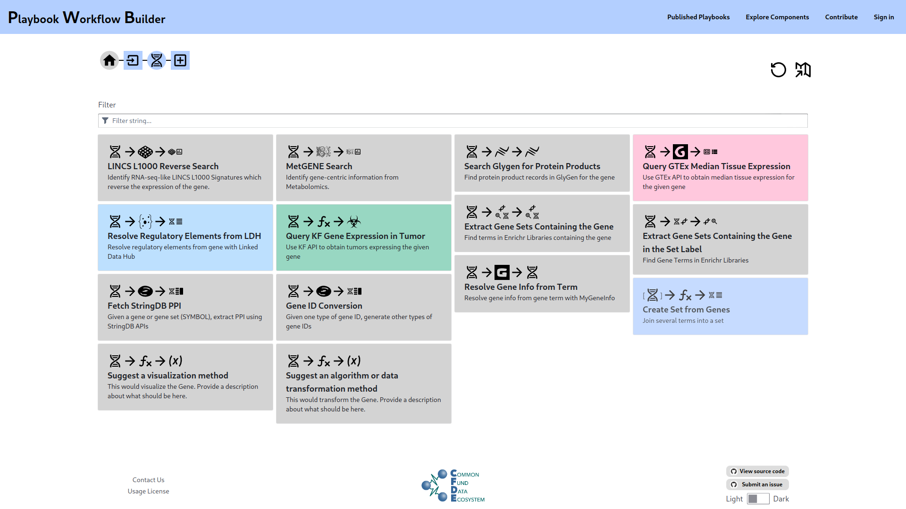
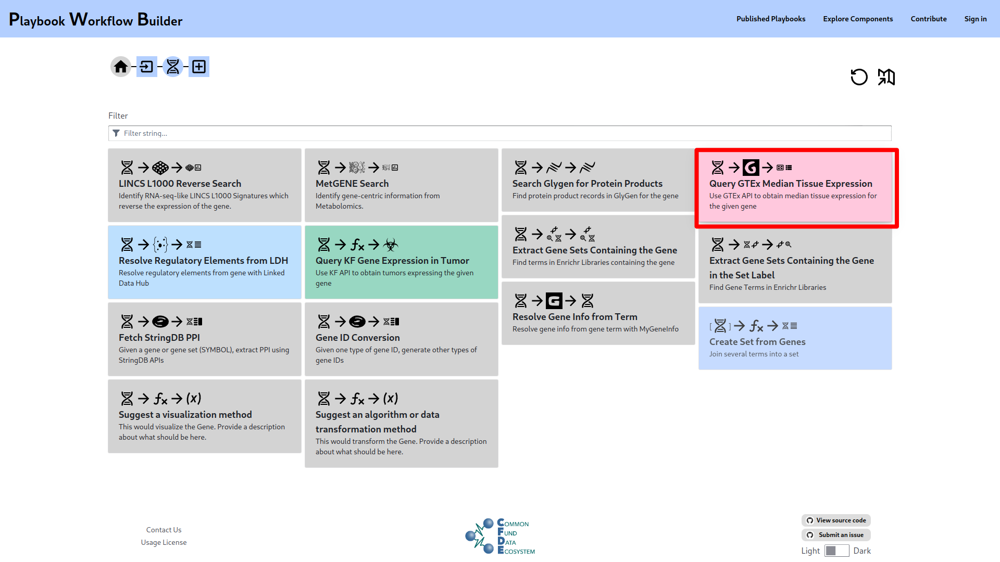
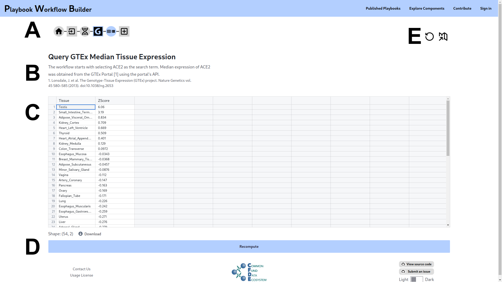
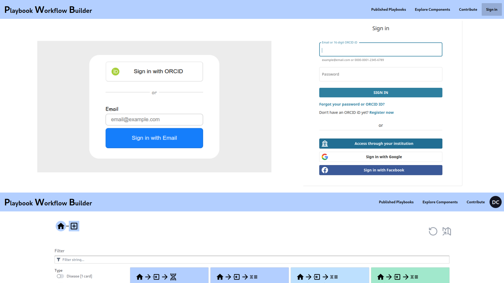

# Playbook Workflow Builder User Guide

The Common Fund Data Ecosystem (CFDE) Playbook Partnership Workflow Builder (PPWB) is a web-based platform that facilitates knowledge resolution by enabling users to traverse an ever-growing network of input datasets, semantically annotated API endpoints, and data visualization tools contributed by the ecosystem. Via a user-friendly web-based user interface, workflows can be constructed from these building-blocks without technical expertise. The output of each step of the workflows are provided in reports containing textual descriptions (stories), as well as interactive and downloadable figures and tables.

**Figure 1.** A screenshot of the playbook workflow builder home page.

The PPWB is accessible at https://playbook-workflow-builder.cloud, the primary interface allows users to make queries by selecting a number of possible options at each step which will be used in future steps. As an initial, let us consider the situation where we are interested in knowledge about a particular gene. To get started we click on the Gene Input card.

**Figure 2.** A screenshot illustrating where to click.

We can now type in a gene symbol, using autocomplete suggestions powered by NCBI official gene symbols. Most official gene symbols should be supported by most components, but gene symbols not in the autocomplete list can also be chosen however there is an increased likelihood that future steps might not operate on those symbols.

**Figure 3.** A screenshot illustrating inputting a gene.

**Figure 4.** A screenshot illustrating submitting a gene.

Once we've clicked submit, the playbook is extended to reveal a slew of new options which can be applied to the gene we specified. Examples include identifying RNA-seq-like LINCS L1000 signatures which reverse the expression of the gene, identifying gene-centric information from metabolomics, finding protein product records in GlyGen or finding regulatory elements in LDH among other possibilities. Let's click on the card: "Query GTEx Median Tissue Expression," which will "Use the GTEx API to obtain median tissue expression for the given gene."

**Figure 5.** A screenshot showing options given a gene.

**Figure 6.** A screenshot illustrating where to click.

Upon clicking this card, we are presented with a table of tissues paired with a significance Z-score representing how significantly the gene we chose at the beginning is expressed in that particular tissue based on the result of GTEx's API (Fig 7. C). These results were computed on-demand when the card was clicked and will be cached for a period of time, if there was a temporary error or if you'd like to confirm the results are up to date the Recompute button can be pressed (Fig 7. D).

Besides the story evolving, a trail of *breadcrumbs* (Fig 7. A) show each step we've taken in the workflow, hovering over each element gives a tooltip showing what it is when the icons aren't obvious and clicking them allows us to see and potentially even modify the workflow at a previous step, including continuing this workflow further by clicking the `+` at the end or going back to the start. It is possible to extend from earlier parts of the workflow creating branches to the same workflow.

The title and the *story* (Fig 7. B) will continue to evolve as the workflow is expanded. Because we've used GTEx Portal's API, it is stated as such and a reference to the GTEx project was added.

**Figure 7.** A screenshot showing the GTEx Median Tissue Expression output along with several points of interest.

The buttons on the top right (Fig 7. E) correspond to starting over with a blank workflow and finalizing the workflow into a report respectively. Clicking on the report mode button (Fig 8) will take the current workflow and arrange it as a linear report (Fig 9).

**Figure 8.** A screenshot of the view report mode button.

In Report Mode, all steps are visible on one page. Cells can be collapsed or expanded by clicking the cell's label, the report can be titled, and manually annotated at the top. With a user account a report can also be saved, published, and shared.

**Figure 9.** A screenshot of the report mode.

Modifications made to earlier steps of a workflow, whether in graph mode or report mode will cause the remaining steps to be recomputed to reflecting this change (Fig 10, 11).

**Figure 10.** A screenshot illustrating a report modification.

**Figure 11.** A screenshot showing the modified report.

It is possible to return to the previous mode for expansion of the workflow by clicking the `View in Graph` or `Expand From this Step` buttons, the former brings you to the item in graph mode, and the later brings you to the expand page from that item.

**Figure 12.** A screenshot showing the expand from this step button in report mode.

Some playbook functionality can only be accessed with an account, the best way to make an account is to Sign in using [ORCID](https://orcid.org/), this will be used for capturing your identity when publishing.

**Figure 13.** A screenshot showing the sign-in flow.

Once signed in, you can save, share, and publish workflow reports you've constructed.

**Figure 14.** A screenshot showing where save share and publish are.

An account is also necessary to upload and manage files.

**Figure 15.** A screenshot illustrating file inputs before and after sign-in.
