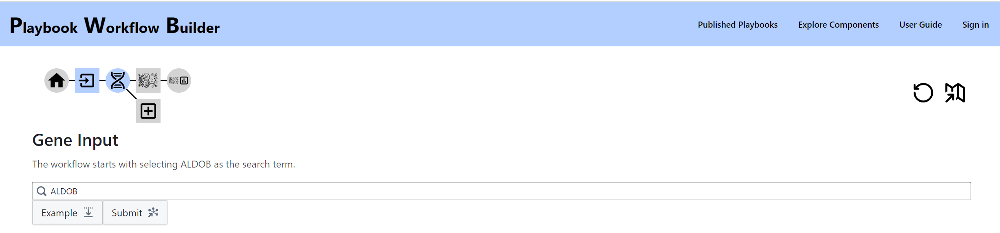
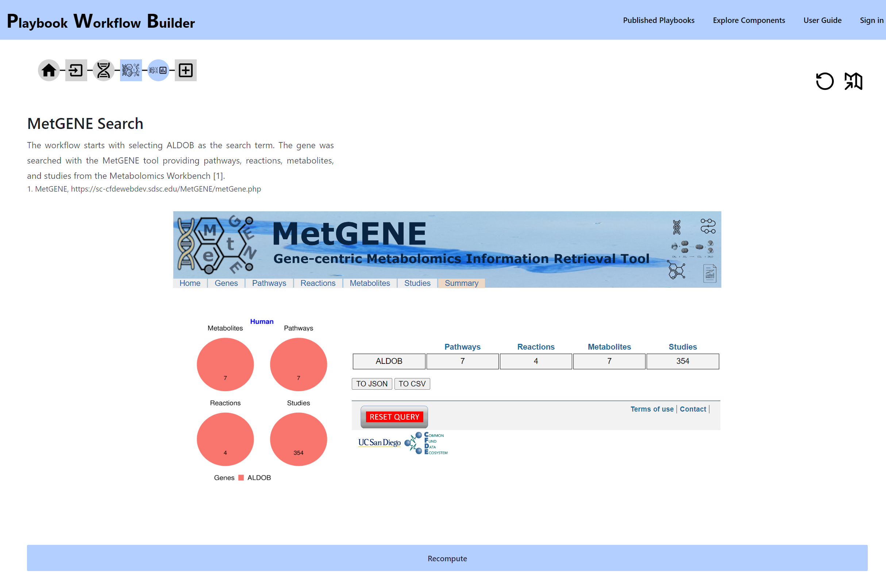
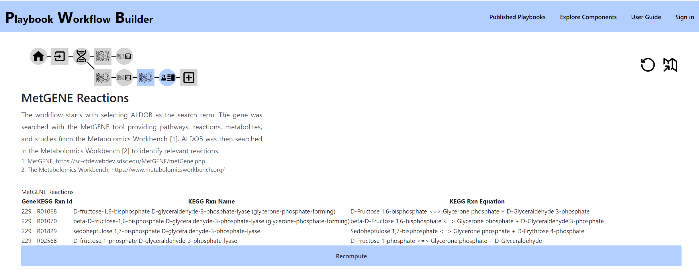
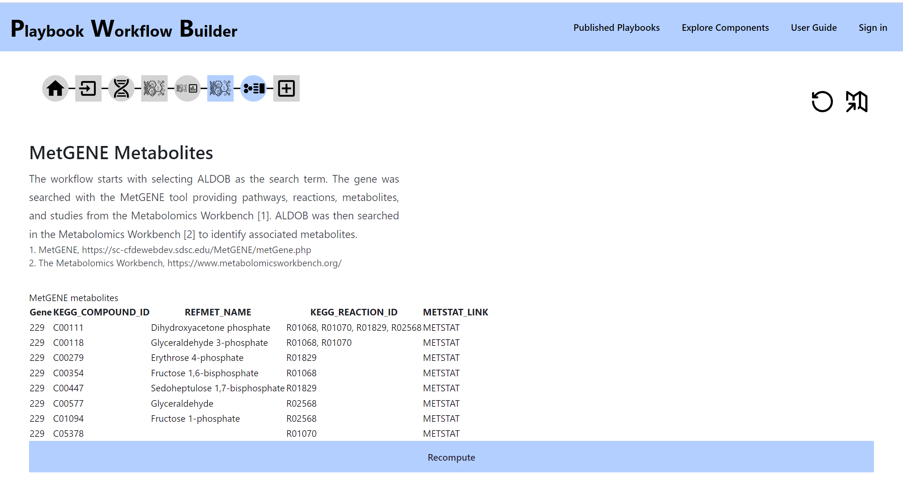
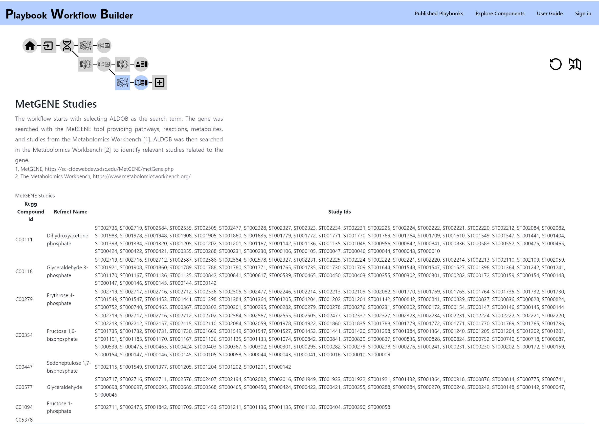

# MetGENE User Guide

## What is MetGENE?
MetGENE stands as a knowledge-based, gene-centric data aggregator, offering a seamless experience in accessing comprehensive information about genes, their related pathways, reactions, metabolites, and metabolomic studies from Metabolomics Workbench. By centralizing relevant data from various standard repositories into one convenient dashboard, MetGENE provides easy access to a wealth of knowledge. It emphasizes genes encoding proteins directly associated with metabolites, ensuring a focused and relevant approach.

What sets MetGENE apart is its ability to contextualize the data further. Users can leverage powerful filtering options to refine their exploration by species, anatomy (tissue), or condition (disease or phenotype). This way, researchers can gain deeper insights, making MetGENE a valuable tool for in-depth analysis and discovery in the field of genomics and metabolomics.

## Why is MetGENE useful?

In the pursuit of advancing diagnosis, treatment, and monitoring in biomedicine, researchers face the intricate task of integrating multi-modal and multi-omic data cohesively. This critical process involves accessing information from diverse sources, often represented in varying and occasionally incongruent formats. Deciphering underlying mechanisms, therefore, requires extensive downstream data processing, involving the reconstruction of networks and the development of quantitative models.

Metabolomics Workbench (<https://www.metabolomicworkbench.org>) is a comprehensive platform that hosts an impressive repository of over 2000 curated metabolomics studies. Through an array of tools and interfaces, this environment empowers researchers to perform data analysis and visualization on metabolomics data thereby facilitating the extraction of valuable biological insights. MetGENE emerges as a transformative solution, bridging the gap between genetic information and metabolomics. By consolidating all relevant gene-related data under one umbrella, MetGENE seamlessly links genes encoding metabolites to their associated pathways, reactions, metabolites, and metabolomic studies within the Metabolomics Workbench. This integrative approach streamlines research efforts, fostering a deeper understanding of the complex interplay between genes and metabolites and opening new avenues for biomedical research.

## What are the features of MetGENE?
Given a gene or a set of genes, MetGENE infers whether it encodes a metabolic enzyme and provides pathways, reactions, metabolites information along with metabolomic studies relevant to the gene. It also provides a summary view listing the number of pathways, reactions, metabolites and studies associated with the gene(s). We provide REST APIs to access this information in JSON, CSV and text formats. MetGENE is an open-source collaborative initiative available at GitHub. The main website of MetGENE (<https://bscw.org/MetGENE>) and the Smart APIs (<https://smart-api.info/registry/?q=MetGENE>) are available.

## MetGENE and Workflow Builder Tool
The MetGENE REST APIs are integrated into the Playbook Workflow Builder Tool. Below, we provide an example of how the MetGENE components can be used in a workflow. Starting with a gene or a set of genes (GeneSet), the first level of query brings up MetGENE Search as one of the processes as shown in Figure 1.

Figure 1. Playbook Workflow builder view after a gene query

Next, we apply the process MetGENE Search and obtain the MetGENE summary view for the genes as shown in Figure 2.

Figure 2. MetGENE Summary view

Further, we can apply MetGENE Reactions, MetGENE Metabolites or MetGENE Studies to access the reactions, metabolite and study information for the genes as shown in Figure 3.

Figure 3. MetGENE Reactions, Metabolites and Studies Views

## Learn More

[Find other topics in the Playbook Workflow Builder user guide](./index.md).
